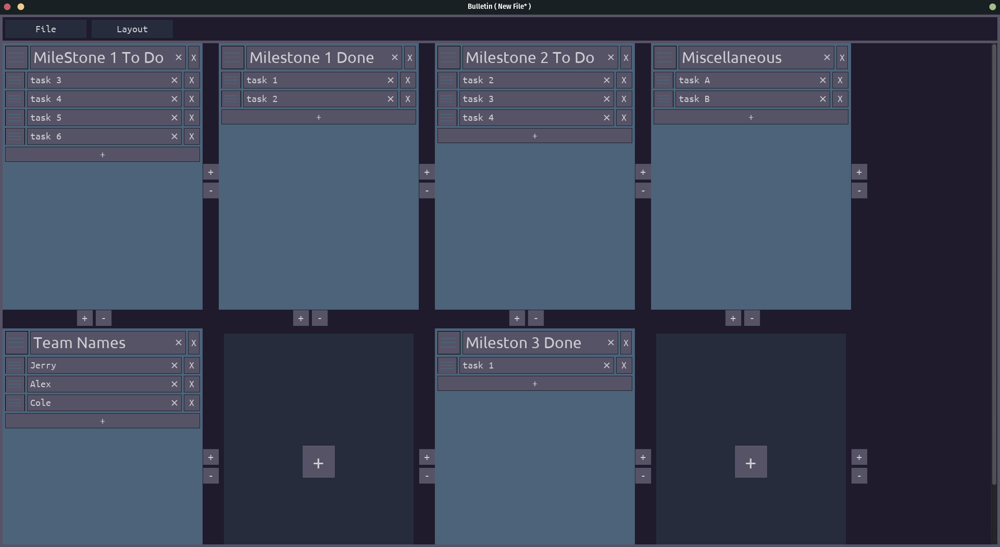
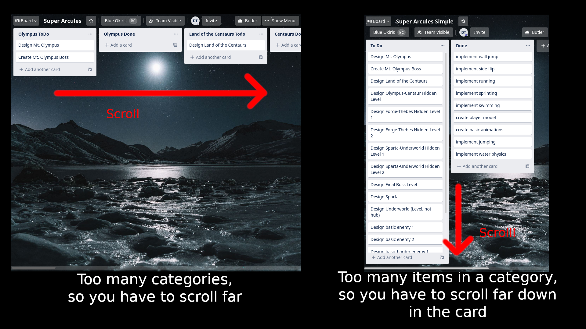

# Bulletin

## Description

A free alternative (sort-of) to the Trello Organizational Software

It misses many features of Trello like coloring and collaboration which may be important to some, but it isn't important to me, and this software is a personal tool.

The big useful difference is that instead of horizontal cards, the cards in Bulletin are arranged on a configurable grid system that allows for arrangement control not seen in Trello.

Example:

## The Problem with Trello

So I've been using the software Trello for a long while, and it's pretty useful, at least for my purposes.

When making a game or other project, I'll make a ToDo list and a Done list, and I can move a task from the ToDo to the done in order to organize. As projects get complicated, I may have a handful of ToDo and Done Lists like "Milestone 1" Todo/Done, "Milestone 2" Todo/Done, etc.

This is a big problem when using Trello though because Trello forces your cards to be arranged in a horizontal line. If you have more than like 5 categories, you have to scroll really far to the right.

Okay, so just don't have lots of categories, right? Well, no, because then your lists get really long and again you have to unnecessarily scroll.

Example:

This is a feature that Trello *knows* about as well. I've looked at forums from various years and the Trello team as constantly acknowledged it's a feature people want. That means, it's unlikely they're doing it.

I got annoyed to the point where I decided to just make my own to suit my purposes, so over the course of a day and half I created this alternative

## Features

You can create, remove, and move cards around to tileable grids. On the cards you can add various tasks which can be moved around within a card or moved between cards. Each card has a title as well.

You can save and load your arrangements for later as well.
